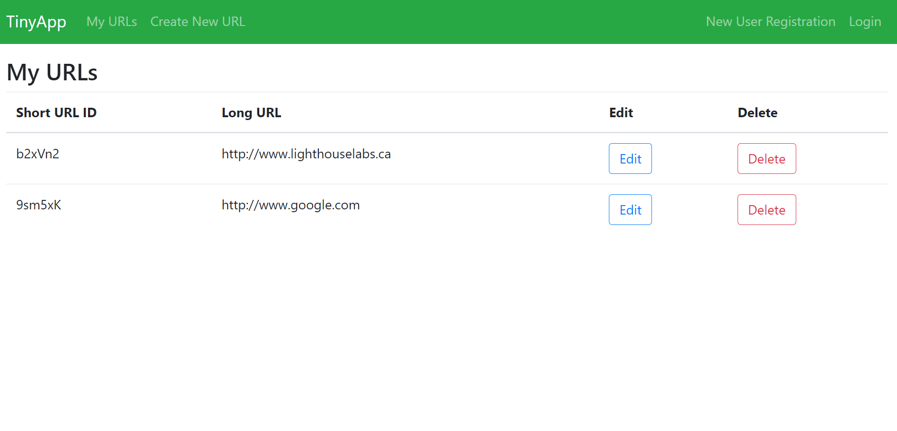
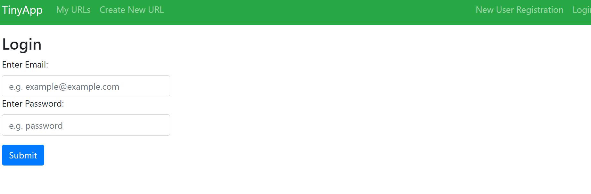
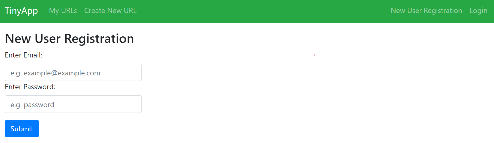
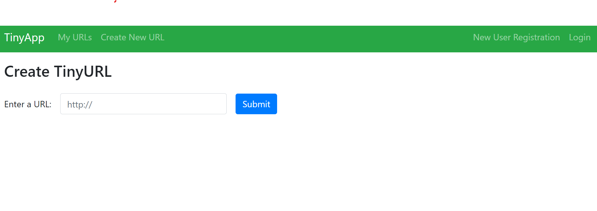
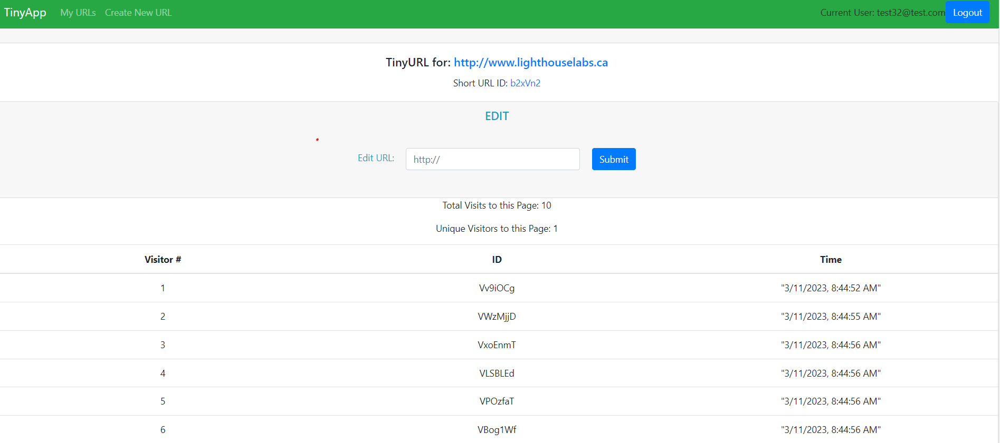

# TinyApp Project

TinyApp is a full stack web application built with Node and Express that allows users to shorten long URLs (à la bit.ly). This app also displays a short analytics session on each shortURL page that shows # of visitors, # of unique visitors, as well as times when people visit the page. These analytics are only accessible when logged in!
This app was built as part of the LighthouseLabs curriculum with help from very helpful mentors who helped me understand 

## Final Product
TinyApp Home Page

Login Page

Registration Page

New Short URL page

Short URL View Page

## Dependencies

- Node.js
- Express
- EJS
- bcryptjs
- cookie-session

## Getting Started

- Install all dependencies (using the `npm install` command).
- Run the development web server using the `node express_server.js` command.
- Navigate to http://localhost:8080/ to get started!
- Create a new account using the app registration page!

## Some interesting notes

- Due to there being no distinct database that saves new user information. IF, for example you create a new a user and make new short URLs, these will be saved IN SESSION ONLY.
  If you shut down the server, the new user you would have just made above would have been CLEARED and will be gone. Also, if you don't hit logout before you exit the session, the cookie will be stored because of how browsers work and the app will CRASH when you open it up. I thought about clearing the cookies upon starting up the app, but I designed this in a way that IF this gets implemented in a real life application, it would be linked to an always-on database that has proper read-write functionality